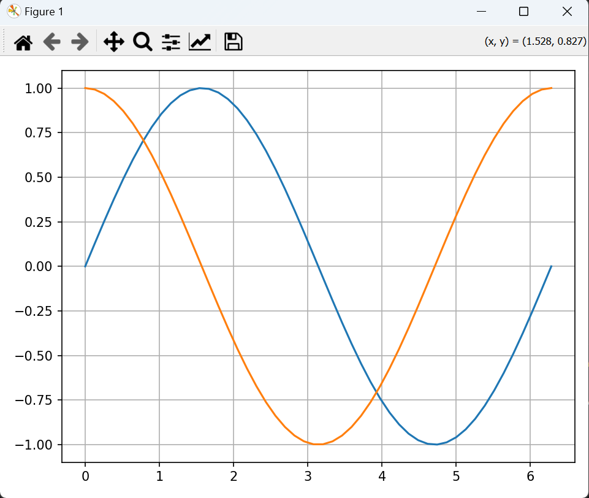
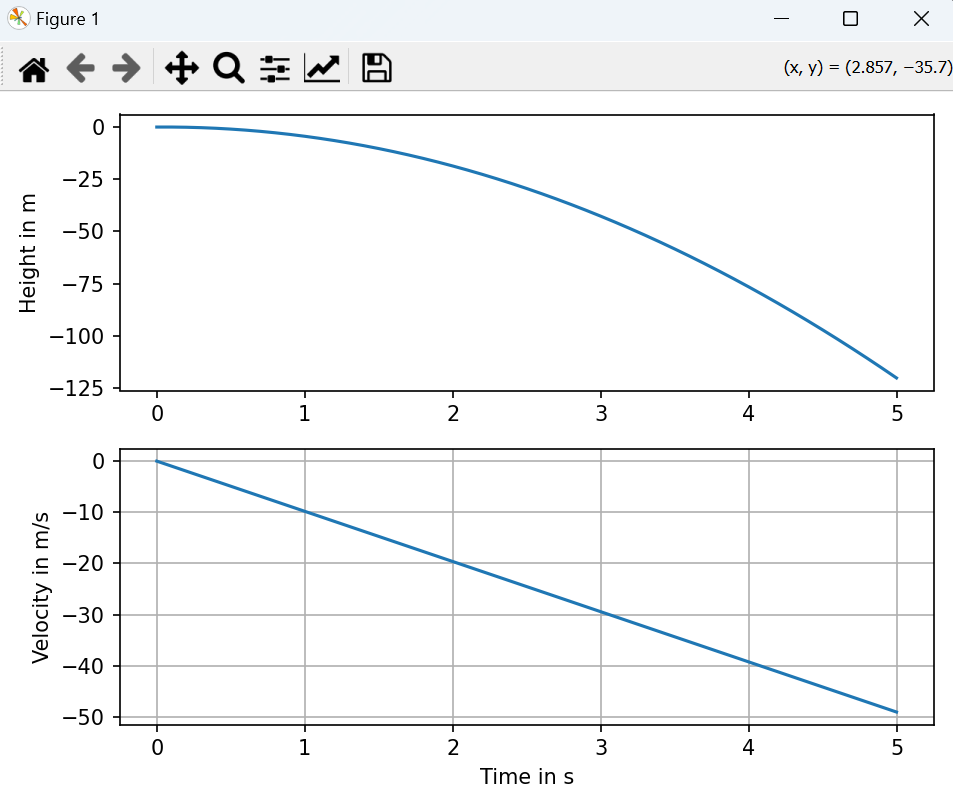

# Base_lines

## 📈 Math Visualizations to Spark Curiosity

This module provides interactive visual representations of mathematical concepts using `matplotlib`. From exploring waves to simulating falling objects — it's all about tryna create that math addiction 😄.

---

### 🧩 What's Included

#### 1. **Sine and Cosine Plot Visualizer**
A clean script to visualize sine and cosine functions:

- Generates evenly spaced values between 0 and 2π
- Computes and plots sine and cosine
- Decorated using a reusable plot helper

📄 Files:
- `Sine_and_Cosine.py`
- `a_replica_viz.py` (plot decorator)

🖼️ Output Preview:


---

#### 2. **Euler’s Method – Free Fall Simulation**
A basic physics simulation using **Forward Euler Method**:

- Models vertical motion under constant gravity
- Tracks both position and velocity over time
- Plots height and velocity on separate subplots

📄 File:
- `Eulerian_free_fall.py`

🖼️ Output Preview:


---

### 🚀 How to Use

1. Clone or download the repository.
2. Run the individual scripts using Python:

```bash
python Sine_and_Cosine.py
python Eulerian_free_fall.py
